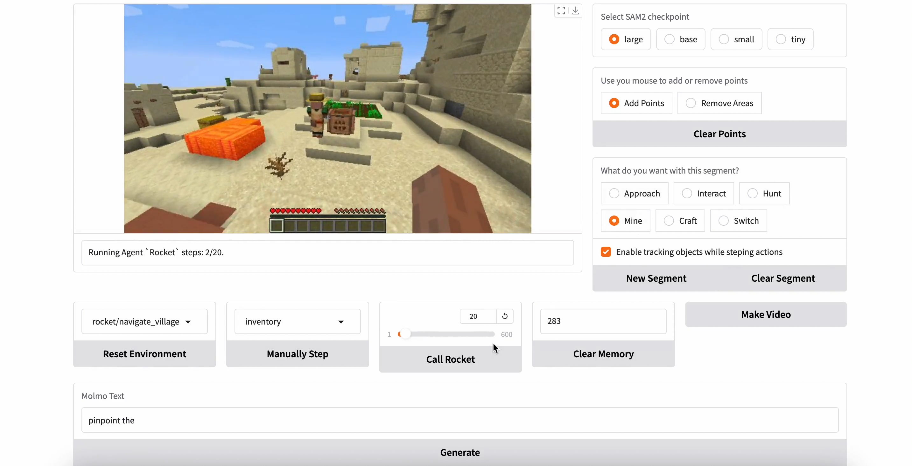

# ROCKET-1: Master Open-World Interaction with Visual-Temporal Context Prompting

[`Shaofei Cai`](https://phython96.github.io/) | [`Zihao Wang`](https://zhwang4ai.github.io/) | [`Kewei Lian`](https://kevin-lkw.github.io/) | [`Zhancun Mu`](https://zhancunmu.owlstown.net/) | [`Xiaojian Ma`](https://jeasinema.github.io/) | [`Anji Liu`](https://liuanji.github.io/) | [`Yitao Liang`](https://scholar.google.com/citations?user=KVzR1XEAAAAJ&hl=zh-CN&oi=ao)

All authors are affiliated with Team **[`CraftJarvis`](https://craftjarvis.github.io/)**. 

[[`Project`](https://craftjarvis.github.io/ROCKET-1/)] | [[`Paper`](https://arxiv.org/abs/2410.17856)] | [[`huggingface`](https://huggingface.co/papers/2410.17856)] | [[`Demo`](https://huggingface.co/spaces/phython96/ROCKET-1-DEMO)] | [[`BibTex`](#citig_rocket)] 


## Latest updates

- **11/03/2024 -- We have built a huggingface space for online demo!**
- **11/02/2024 -- ROCKET-1 inference scripts is released!**

## Docker

```sh
docker run -it -p 7860:7860 --platform=linux/amd64 --gpus all \
	registry.hf.space/phython96-rocket-1-demo:latest 
```

## Installation

First, download the scripts and install dependencies. 

```sh

sudo apt-get install libghc-x11-dev gcc-multilib g++-multilib \
    libglew-dev libosmesa6-dev libgl1-mesa-glx libglfw3

git clone git@github.com:CraftJarvis/ROCKET-1.git
conda create -n rocket python=3.10
conda activate rocket
conda install --channel=conda-forge openjdk=8
# install ROCKET-1
cd ROCKET-1
pip install -e .
# install scripts for realtime segmentation
cd rocket/realtime_sam
pip install -e .
# download segment-anything-model checkpoints
cd checkpoints
bash download_ckpts.sh
```

Second, download the MCP-Reborn.zip from huggingface and check if the environment runs well. 

```sh
cd rocket/stark_tech
# download the simulator (Minecraft 1.16.5)
python -c "from huggingface_hub import hf_hub_download;hf_hub_download(repo_id='phython96/ROCKET-MCP-Reborn', filename='MCP-Reborn.zip', local_dir='.')"
unzip MCP-Reborn.zip && rm MCP-Reborn.zip

# check if the simulator runs well
python env_interface.py
```

If you can see these logs, it means the simulator works well!
```
[Close-ended] Slow reset with world seed:  19961103
INFO: Starting Minecraft process with device: cpu
{'img': Box(0, 255, (224, 224, 3), uint8), 'text': <class 'str'>, 'obs_conf': typing.Dict}
Dict('buttons': MultiDiscrete([8641]), 'camera': MultiDiscrete([121]))
frame: 0, fps: 32.88, avg_fps: 32.88
frame: 50, fps: 28.52, avg_fps: 30.54
frame: 100, fps: 1.29, avg_fps: 29.70
...
```


## Usage
```python
from rocket.arm.models import ROCKET1
from rocket.stark_tech.env_interface import MinecraftWrapper

model = ROCKET1.from_pretrained("phython96/ROCKET-1").to("cuda")
memory = None
input = {
  "img": torch.rand(224, 224, 3, dtype=torch.uint8), 
  'segment': {
    'obj_id': torch.tensor(6),                              # specify the interaction type
    'obj_mask': torch.zeros(224, 224, dtype=torch.uint8),   # highlight the regions of interest
  }
}
agent_action, memory = self.agent.get_action(input, memory, first=None, input_shape="*")
env_action = MinecraftWrapper.agent_action_to_env(agent_action)

# --------------------- the output --------------------- #
# agent_action = {'buttons': tensor([1], device='cuda:0'), 'camera': tensor([54], device='cuda:0')}
# env_action = {'attack': array(0), 'back': array(0), 'forward': array(0), 'jump': array(0), 'left': array(0), 'right': array(0), 'sneak': array(0), 'sprint': array(0), 'use': array(0), 'drop': array(0), 'inventory': array(0), 'hotbar.1': array(0), 'hotbar.2': array(0), 'hotbar.3': array(0), 'hotbar.4': array(0), 'hotbar.5': array(0), 'hotbar.6': array(0), 'hotbar.7': array(0), 'hotbar.8': array(0), 'hotbar.9': array(0), 'camera': array([-0.61539427, 10.        ])}
```

## Interaction Details

Here are some interaction types:
| interaction | obj_id | function | 
| --- | --- | --- |
| Hunt     | 0 | Approach the animals then kill it. | 
| Mine     | 2 | Approach and mine the target object. |
| Interact | 3 | Approach and right click the target object. | 
| Craft    | 4 | Move the cursor to the item and click on it. |
| Switch   | 5 | Highlight an item in the hotkey bar, then switch to holding state. | 
| Approach | 6 | Approach the target object. |

## Play ROCKET-1 with Gradio
Click the following picture to learn how to play ROCKET-1 with gradio. 
[](https://www.youtube.com/embed/qXLWw81p-Y0)

```sh
cd rocket/arm
python eval_rocket.py --port 8110 --sam-path "/path/to/sam2-ckpt-directory"
```


## Citing ROCKET-1
If you use ROCKET-1 in your research, please use the following BibTeX entry. 

```
@article{cai2024rocket,
  title={ROCKET-1: Master Open-World Interaction with Visual-Temporal Context Prompting},
  author={Cai, Shaofei and Wang, Zihao and Lian, Kewei and Mu, Zhancun and Ma, Xiaojian and Liu, Anji and Liang, Yitao},
  journal={arXiv preprint arXiv:2410.17856},
  year={2024}
}
```
